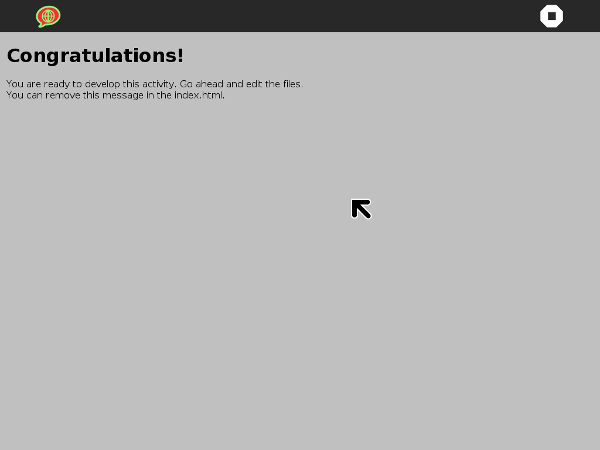
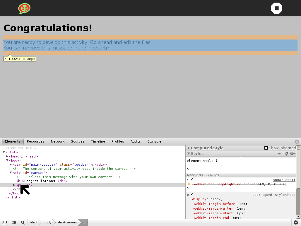

Write your own web activity
===========================

### Choose your development environment

You've got two choices to develop your own web activity for Sugar:

- Using osbuild
- Using Sugarizer

**osbuild** is the Sugar build environment. With **osbuild** you've got a full Sugar environment. It's the better choice if you've enought knowledge to build your environment on GNU Linux.

**Sugarizer** simulate the Sugar environment in a browser. So you need only a browser to start developing. It's the better choice if you've no time or knowledge to learn how to build Sugar on a GNU Linux distribution but you're not exactly in a real Sugar environment.

### Create the activity from the template 

On **osbuild**, after you have [built](dev-environment.md.html) the development
environment, enter the sugar-build shell

    ./osbuild shell

Create an activity based on the default template

    volo create my-activity ./sugar-web-template
    cd my-activity

On **Sugarizer**, after you've cloned - or copied - the [Sugarizer repository](https://github.com/llaske/Sugarizer), copy all content of `activities/ActivityTemplate` directory in a new directory `activities/MyActivity.activity`.

### Customize
Choose a name for your activity.  Write it in the activity name and
bundle-id in `activity/activity.info` of the new directory.

And also in the title tag of `index.html`.

On **osbuild**, install the activity for development

    python setup.py dev

On **Sugarizer**, update the file `activities.json` of the Sugarizer directory: add a new line for your activity. Update id, name and directory values on this new line.

Now you should have a basic activity running!

### File structure

In your new activity, you will find the following file structure:

    my-activity/
    |-- activity/
    |   |-- activity.info
    |   `-- activity-icon.svg
    |-- index.html
    |-- css/
    |   `-- activity.css
    |-- js/
    |   |-- activity.js
    |   `-- loader.js
    |-- lib/
    |-- package.json
    `-- setup.py

* `activity/` contains information about your activity, including the
  name, ID, and the icon.

* `index.html` is where the elements that compose your activity are
  defined.  The template comes with a toolbar and a canvas where you
  can place your content.

* `js/activity.js` is where the logic of your activity lives.

* `css/activity.css` is where you add the styling of your activity.

Those are the files you'll modify in most cases. The others are:

* `js/loader.js` configures the libraries paths and loads your
  `js/activity.js` . You can add [non-AMD libraries](#non-amd%20libs) here.

* `lib/` contains the libraries

* `package.json` contains information about the libraries the activity
  depends

* `setup.py` lets you install your activity or make an installable
  bundle with it

Now you are ready to go ahead and develop your activity in the html,
js and css files.

### Revision control your code

For development you can initialize the repository as a git
repository. This will help you to track your changes. First use [git
init](https://www.kernel.org/pub/software/scm/git/docs/git-init.html)
to initialize the repository:

    git init

With [git
status](https://www.kernel.org/pub/software/scm/git/docs/git-status.html)
you can show the available files in the folder they are still
untracked. Now add all the files in the directory besides the lib
folder and commit those changes, you can use git status again to see
the current state:

    git add .
    git commit -a -m 'Initial import'
    git status

### First steps

#### Adding a button to the toolbar

This simple example will show you how web activities are structured as
bits of HTML, CSS and JavaScript.

You will need a SVG graphic for the button.  Or you can use one from
the Sugar icon set at `lib/sugar-web/graphics/icons/`.  For this
example, let's say you have one custom icon called `my-button.svg`.
Create a directory `icons/` inside your activity and place the SVG
file inside.  Then do the following steps.

In `index.html`, add a new &lt;button&gt; element inside the toolbar:

    <button class="toolbutton" id="my-button" title="My Button"></button>

In `css/activity.css`, define the button style:

    #main-toolbar #my-button {
        background-image: url(../icons/my-button.svg);
    }

In `js/activity.js`, add a callback for the button:

    var myButton = document.getElementById("my-button");
    myButton.onclick = function () {
        console.log("You clicked me!");
    }

#### Adding HTML content dynamically

Soon you will find that adding content to the HTML as we did with the
toolbar button in the previous section, is very limited.  You'll want
to add HTML elements on the fly, as the user interacts with the
activity, or as the data structures of your activity logic change.
There are several options to archive this.  Most of the time you'll
end using a mix of them, so is important to know them all.

First, it is possible to create HTML elements and append them to other
HTML elements using JavaScript.  This is called "manipulating the
DOM".

For example, to create a new div with class 'my-div', and append it to
the canvas div, you can do:

    myElem = document.createElement('div');
    myElem.className = "my-div";
    var canvas = document.getElementById("canvas");
    canvas.appendChild(myElem);

But it is a pain to do that for large HTML structures.  Writing HTML
directly is much better:

    var canvas = document.getElementById("canvas");
    canvas.innerHTML +=
        '<ul id="names-list">' +
          '<li class="name">Tom</li>' +
          '<li class="name">Chris</li>' +
          '<li class="name">Donald</li>' +
        '</ul>';

Nice, that saves us many JavaScript lines.  But what if the HTML
depends on your data?  Let's say you have an array of names and you
want one &lt;li&gt; per name, as in the previous example.  You have
two options: 1. go back to use the JavaScript methods for DOM
manipulation, or 2. use a template system.

There are many template systems out there, and you can use whatever
you like.  Let's try [mustache](http://mustache.github.io/) here.

Add mustache to your activity:

    volo add mustache

Import mustache in your `js/activity.js`:

    var mustache = require("mustache");

Use it:

    var template =
        '<ul id="names-list">' +
          '{{#names}}' +
          '<li class="name">{{ name }}</li>' +
          '{{/names}}' +
        '</ul>';

    var data = {names: [{name: "Laura"}, {name: "Joao"},
                        {name: "Willy"}, {name: "Sandra"}]};

    var containerElem = document.getElementById("container");
    containerElem.innerHTML = mustache.render(template, data);

### Debugging

If you want to inspect the code, you can press ctrl+shift+I while your
Activity is running.

The inspector is a very useful tool for many things. For example, you
can edit the activity CSS or HTML, and interactively see how it is
affected. Or you can execute JavaScript commands in the console.

It has also more advanced tools for JavaScript debugging. They are
nicely documented here:
<https://developers.google.com/chrome-developer-tools/docs/javascript-debugging>.

### Keeping Sugar libraries up to date

The activity depends on the
[sugar-web](http://github.com/sugarlabs/sugar-web) library
that provides the Sugar API and the Sugar look & feel.

This means that if there are changes to the library you have to update your
local copy. You can do this (on **osbuild** only) with running the following command inside the
activity directory:

    volo add -f

### Using other JavaScript libraries

#### AMD-ready

You can easily add AMD-ready libraries with volo.  For example, to add
[RaphaelJS](http://raphaeljs.com/):

    [osbuild my-activity]$ volo add DmitryBaranovskiy/raphael
    Downloading: https://codeload.github.com/DmitryBaranovskiy/raphael/legacy.zip/v2.1.2
    Installed github:DmitryBaranovskiy/raphael/v2.1.2 at lib/raphael.js
    AMD dependency name: raphael

Then in `js/activity.js` you can use it:

    var raphael = require("raphael");

#### non-AMD libs

Please, refer to
RequiresJS [shim section](http://requirejs.org/docs/api.html#config-shim),
then you can add your shim section in `js/loader.js`

### Ready to release

Before your first release, you should:

* make your activity unique in the Sugar interface by changing your
  activity icon activity/activity-icon.svg .  Or if you don't have
  graphics skills, you can ask in the community if someone can do it.

After that, on **osbuild** you can make an XO bundle and upload it to the Sugar
activities market <http://activities.sugarlabs.org/> .

    python setup.py dist_xo

With **Sugarizer**, you can't directly publish the XO bundle because the content of the `lib\sugar-web` directory is specific to Sugarizer. So, if you want to publish your activity you'll have to replace the `lib\sugar-web` directory content by the one from the [git repository](https://github.com/sugarlabs/sugar-web). Then zip the content of your `activities/MyActivity.activity` directory and rename the `.zip` file to a `.xo` file.

For further releases, you should update the activity_version in
`activity/activity.info`.
